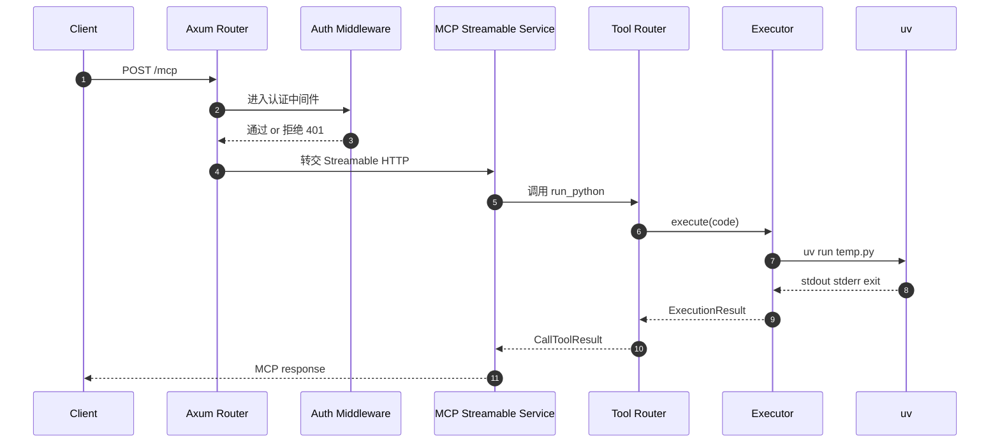

# codebox-rmcp 架构设计

> 目标：实现一个 Rust MCP (Model Context Protocol) 服务器，接收 Python 代码字符串并通过 `uv run` 执行，返回执行结果。

本文档描述 `codebox-rmcp` 的推荐架构与模块职责划分，便于在后续实现时遵循 Rust lib + bin 最佳实践，并保持功能边界清晰、可测试、可演进。

---

## 1. 总览

### 1.1 核心能力

- 对外提供一个 HTTP 服务端点：MCP Streamable HTTP。
- 暴露 MCP 工具：`run_python`。
- 工具输入：`code: String`（Python 代码）。
- 工具行为：将代码写入临时文件，执行 `uv run <temp_file.py>`，收集 stdout / stderr / exit code，并在超时后终止。
- 安全：基于 Bearer Token 的简单认证，保护 MCP 端点；健康检查公开。

### 1.2 关键设计原则

- **lib 与 bin 分离**：bin 仅负责启动与组装；核心逻辑下沉到 lib，便于复用与测试。
- **单一职责**：执行器、工具定义、认证、服务器组装彼此隔离。
- **可观测性**：tracing 日志贯穿请求与执行过程；错误带上下文。
- **可靠性**：超时控制、资源清理、合理的错误分类。

---

## 2. 项目结构（建议）

遵循 Rust lib + bin 最佳实践，源代码按功能拆分如下：

```text
src/
├── main.rs          # bin入口：启动HTTP服务器
├── lib.rs           # lib入口：导出模块
├── executor.rs      # Python代码执行器（uv run）
├── tools.rs         # MCP工具定义（ServerHandler + tool_router）
├── auth.rs          # Token认证中间件
└── server.rs        # HTTP服务器配置与路由
```

> 说明：即便当前仓库只有 [`src/main.rs`](../src/main.rs:1)，也建议按上述结构演进，以便快速扩展更多工具或策略。

---

## 3. 运行时与请求链路

### 3.1 时序（简化）



### 3.2 路由与暴露面

- `GET /health`：公开健康检查，返回 200（可附带版本号或 build 信息）。
- `POST /mcp`：MCP Streamable HTTP 端点，受 token 认证保护。

---

## 4. 模块设计

本节按文件划分说明职责、关键类型、关键流程与错误处理策略。

### 4.1 `executor.rs`：Python 执行器

文件：[`src/executor.rs`](../src/executor.rs:1)

#### 职责

- 接收 Python 代码字符串。
- 创建临时文件并写入代码。
- 使用 [`tokio::process::Command`](../src/executor.rs:1) 调用 `uv run <temp_file.py>`。
- 捕获 stdout / stderr。
- 执行超时控制（默认 60 秒，可配置）。
- 清理临时文件（依赖 tempfile 的自动清理或显式删除）。
- 返回结构化执行结果。

#### 建议公开接口

- `pub struct ExecutionResult { stdout: String, stderr: String, exit_code: i32 }`
- `pub struct Executor { timeout: Duration }`
- `impl Executor { pub async fn run_python(&self, code: &str) -> Result<ExecutionResult, ExecutorError> }`

#### 关键流程

1. `tempfile` 创建临时目录或临时文件（扩展名 `.py` 便于调试）。
2. 将 `code` 写入文件；必要时确保末尾换行。
3. 构造 `uv run <path>` 子进程：
   - `stdout` / `stderr` 设置为 piped。
   - 环境变量：可保持继承；若后续需要隔离，可在此收敛。
4. 用 [`tokio::time::timeout`](../src/executor.rs:1) 包裹等待逻辑：
   - 超时则 kill 子进程并返回超时错误。
5. 汇总输出，构造 `ExecutionResult`。

#### 错误处理建议

- `uv` 不存在 / 启动失败：返回 `ExecutorError::SpawnFailed`。
- 超时：返回 `ExecutorError::Timeout`，并尽最大努力终止子进程。
- 非 0 exit code：**不作为 Rust 错误**（因为 Python 语法错误也应返回给调用方），而是用 `exit_code != 0` 体现；同时 stdout/stderr 完整返回。

> 安全提示：该工具执行任意 Python 代码，属于高危能力；务必依赖 token 鉴权，并在部署层配合容器/权限/网络隔离。

---

### 4.2 `tools.rs`：MCP 工具定义与路由

文件：[`src/tools.rs`](../src/tools.rs:1)

#### 职责

- 使用 rmcp 的宏定义 MCP 工具。
- 用 [`#[tool_router]`](../src/tools.rs:1) 暴露 `run_python` 工具。
- 实现 [`ServerHandler`](../src/tools.rs:1) trait，将工具调用接入执行器。

#### 工具：run_python

- 名称：`run_python`
- 入参：`code: String`
- 出参：[`CallToolResult`](../src/tools.rs:1)
  - 推荐返回一个 JSON 文本或结构化内容（取决于 rmcp 对 result 的表达方式），至少包含：
    - `stdout`
    - `stderr`
    - `exit_code`

#### 分层建议

- `ToolsHandler`（或 `AppHandler`）持有 `Executor`，并在工具实现中调用它。
- 业务逻辑尽量不耦合 axum；`tools.rs` 只关心 MCP/rmcp。

---

### 4.3 `auth.rs`：Token 认证

文件：[`src/auth.rs`](../src/auth.rs:1)

#### 职责

- `TokenStore`：从 `.env` 读取 token 列表（逗号分隔），存入 `HashSet<String>`。
- `extract_token()`：从 `Authorization` header 提取 Bearer token。
- `auth_middleware()`：axum middleware 验证 token。

#### 设计要点

- `.env` 读取建议使用 [`dotenvy`](../src/main.rs:1) 在启动时加载，然后从 `std::env` 获取 `AUTH_TOKENS`。
- 解析规则：
  - 以逗号切分
  - trim 空白
  - 过滤空字符串
- 中间件：
  - 缺失 header 或格式错误：401
  - token 不匹配：401
  - 通过：调用 next

#### 可测试性

- `extract_token()` 与 `TokenStore::from_env()` 做成纯函数/小函数，便于单元测试。

---

### 4.4 `server.rs`：HTTP 服务器与路由组装

文件：[`src/server.rs`](../src/server.rs:1)

#### 职责

- 构建 rmcp 的 [`StreamableHttpService`](../src/server.rs:1)（MCP Streamable HTTP 传输）。
- 配置 axum 路由：
  - `/health`：公开
  - `/mcp`：受 [`auth_middleware()`](../src/auth.rs:1) 保护
- CORS 配置（tower-http）。

#### 路由建议（概念）

- `Router::new()`
  - `.route("/health", get(health_handler))`
  - `.route("/mcp", post(mcp_handler))`
  - `.layer(cors_layer)`
  - `/mcp` 子路由或 handler 内接入认证 middleware

> 备注：CORS 的策略取决于部署环境。若只面向服务端调用，建议默认收紧；如需浏览器访问，再开放特定 origin。

---

### 4.5 `main.rs`：启动入口

文件：[`src/main.rs`](../src/main.rs:1)

#### 职责

- 加载 `.env` 配置。
- 初始化 tracing 日志（建议 `tracing_subscriber`）。
- 构造 `TokenStore`、`Executor`、`ToolsHandler` 与服务器路由。
- 调用 `server` 模块启动监听。

#### 建议风格

- `#[tokio::main] async fn main()`
- 错误返回：统一用 `anyhow` 或自定义 error（实现阶段再定）。

---

### 4.6 `lib.rs`：库入口

文件：[`src/lib.rs`](../src/lib.rs:1)

#### 职责

- `pub mod executor; pub mod tools; pub mod auth; pub mod server;`
- 导出关键类型（可选）：如 `Executor`、`TokenStore`、`build_router()`。

---

## 5. 配置设计（.env）

建议的 `.env` 配置项：

```dotenv
AUTH_TOKENS=token1,token2,token3
SERVER_HOST=0.0.0.0
SERVER_PORT=8080
EXECUTION_TIMEOUT=60
```

读取策略：

- `SERVER_HOST`：字符串，默认 `0.0.0.0`
- `SERVER_PORT`：u16，默认 `8080`
- `EXECUTION_TIMEOUT`：秒数 u64，默认 `60`
- `AUTH_TOKENS`：必填（生产建议必填）；开发可允许为空并打印警告（实现阶段决定是否允许“无鉴权模式”）

---

## 6. 依赖清单（建议）

核心依赖：

- `rmcp = "0.14.0"`（features: `server`, `macros`, `transport-streamable-http-server`, `auth`, `schemars`）
- `tokio`（`full`）
- `axum`
- `serde` / `serde_json`
- `tracing` / `tracing-subscriber`
- `dotenvy`
- `tempfile`
- `tower-http`（CORS）

> 注：当前 [`Cargo.toml`](../Cargo.toml:1) 还是空依赖状态，实现时需要补齐。

---

## 7. 安全与隔离建议

该服务执行任意代码，建议至少具备以下防护：

- 强制 token 鉴权（`/mcp` 端点）。
- 最小权限运行（非 root、限制文件系统权限）。
- 资源限制：超时 +（可选）内存/CPU 限制（可通过容器或 cgroup）。
- 网络隔离：如不需要外网访问，禁用或限制出站网络。
- 审计日志：记录请求 id、执行耗时、exit_code，但避免把敏感代码全文写入日志（可做截断或哈希）。

---

## 8. 可测试性与演进方向

### 8.1 单元测试建议

- `auth.rs`：token 解析、header 提取、鉴权判断。
- `executor.rs`：
  - 简单 `print` 用例（假设 CI 环境可用 `uv`）。
  - 超时用例（例如 `while True: pass`）。
  - 语法错误用例（exit_code != 0，stderr 非空）。

### 8.2 未来扩展

- 增加更多工具（例如运行脚本带输入、返回结构化 artifacts）。
- 支持工作目录、依赖安装策略（uv 的 project / venv 模式）。
- 对输出进行大小限制与截断，防止返回过大结果。

---

## 9. 参考实现位置

仓库提示中提到 `rmcp-example` 可作为参考（实现阶段可再引入对照）。

