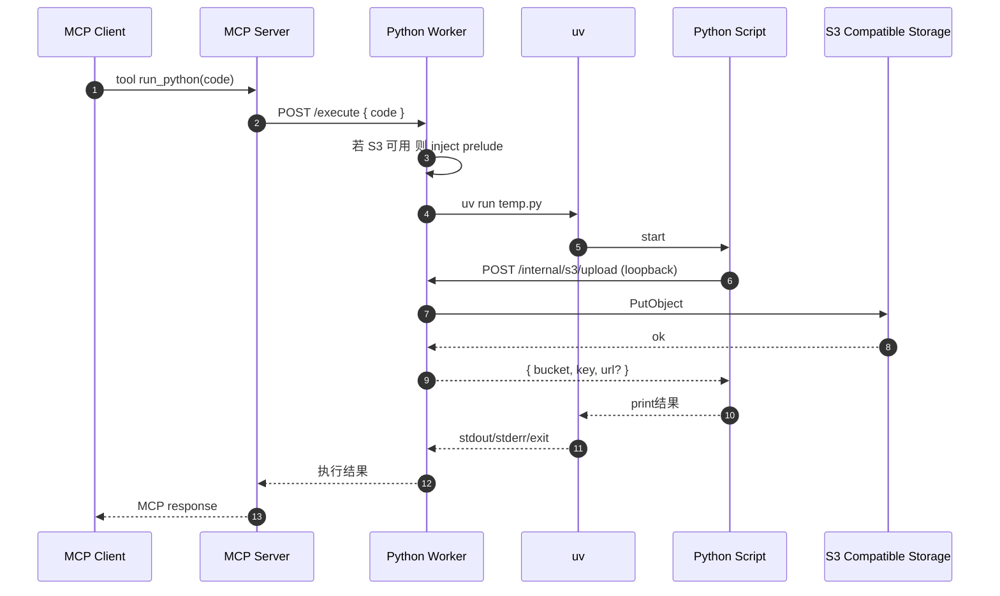

# Python 脚本 S3 对象注入方案设计（可选启用、失败回退）

> 目标：在 `codebox-rmcp` 执行用户 Python 脚本时，**按需**注入一组“可直接使用的 S3 上传/取 URL 接口”，让脚本能够把生成文件上传到外置对象存储（S3 兼容：MinIO、rustfs）。
>
> 约束（来自需求）：
> - **S3 注入是可选项**：环境未配置/连接失败 => 行为与现在完全一致（不注入，不新增可用函数）。
> - **不向 Python 暴露 S3 client**，只给封装后的上传/取 URL 接口。
> - **连接信息由 `.env` 提供**，对象存储为**外置 rustfs**（S3 兼容 endpoint）。

---

## 1. 现状架构梳理：Python 代码如何被执行

### 1.1 调用链路（当前实现）

1) MCP 主服务（Streamable HTTP）提供 `run_python` 工具：[`PythonRunner::run_python()`](../src/tools.rs:51)

2) `run_python` 不在主服务本地执行 Python，而是通过 Worker HTTP 调用：[`WorkerClient::execute()`](../src/worker_client.rs:60)

3) Worker 进程提供 `POST /execute`：[`execute()`](../src/bin/worker.rs:36)

4) Worker 内部调用本地执行器，把 Python 代码写入临时文件并用 `uv run` 运行：[`execute_python()`](../src/executor.rs:48)

> 关键点：**“真正运行 Python 子进程”的地方在 Worker**（`codebox-worker`），因此“注入代码”最佳落点也在 Worker。

### 1.2 与注入相关的现状问题（影响安全与可用性）

- 目前子进程通过 [`tokio::process::Command`](../src/executor.rs:61) 启动，默认会**继承 Worker 的全部环境变量**。
  - 若我们把 S3 凭证注入到 Worker 环境变量中，而不做处理，Python 代码将可以 `import os; print(os.environ)` 直接读取凭证。
  - 这与“凭证不应暴露给用户”的安全目标冲突。
- `uv` 的脚本依赖声明块需要位于脚本顶部（示例见 [`PythonRunner::run_python()`](../src/tools.rs:31) 注释中的 `# /// script`），因此注入逻辑必须**保留该头部块在最前**，不能简单无脑 prepend。

---

## 2. 设计目标与非目标

### 2.1 目标

1. **可选启用 + 失败回退**：
   - 未配置 S3 环境变量 => 不注入。
   - 配置了但连接失败（启动时健康检查失败）=> 不注入。
   - 注入关闭时，脚本执行方式与输出结构保持不变。

2. **安全边界**：
   - Python 进程拿不到 S3 凭证。
   - Python 侧仅获得有限能力函数：上传文件、生成/获取 URL。
   - Worker 侧对可访问的 key 做约束（至少 prefix 约束），避免“任意读写 bucket”。

3. **S3 兼容**：
   - endpoint 可配置（MinIO、rustfs）。
   - 支持 path-style（MinIO/rustfs 常见）。
   - 支持 http/https。

4. **提示词可用性**：
   - 在提示词中明确：S3 可能存在/可能不存在；如果存在，如何使用注入函数。

### 2.2 非目标（本方案不覆盖或仅给建议）

- 不做“语言级沙箱”。Python 仍可执行任意代码（安全隔离参考 [`docs/security-sandbox-design.md`](security-sandbox-design.md:1)）。
- 不在本阶段引入队列/任务编排或多租户配额体系。
- 不强制实现对象存储的读/列举能力（优先只做 upload + presign/get-url）。

---

## 3. 总体方案：在 Worker 侧做注入 + Rust 侧持有 S3 凭证

### 3.1 核心思路

1) Worker 在启动时（或首次请求时）尝试基于环境变量初始化 S3 客户端（Rust 侧），并执行一次轻量连接检查（例如 `HeadBucket`）。

2) 若检查成功：Worker 在执行每个 Python 脚本之前，把一段 **Python prelude** 注入到代码中：

- 该 prelude **不包含任何 S3 凭证**。
- prelude 只暴露两个函数（示例命名）：
  - `codebox_s3_upload(local_path, key=None, content_type=None) -> dict`
  - `codebox_s3_presign_url(key, expires_seconds=3600, method='GET') -> str`

3) 上述 Python 函数通过 **loopback HTTP** 调用 Worker 的内部接口（同一容器内 `127.0.0.1:9000`），由 Worker（Rust）实际执行 S3 操作。

4) 若未启用/连接失败：Worker 不注入任何 prelude，脚本行为保持现状。

### 3.2 时序图（启用 S3 时）



---

## 4. 需要修改的文件（设计级清单）

> 本节仅列“需要动”的位置与职责，不实现代码。

### 4.1 Worker 侧（关键）

- [`src/bin/worker.rs`](../src/bin/worker.rs:1)
  - 在 `AppState` 中增加可选的 `S3Manager`（或 `Option<S3Manager>`）
  - 启动时读取/初始化 S3 配置并做连接检查
  - 在 `execute()` 中调用 `inject_if_enabled(code, job_ctx)`
  - 新增内部路由：
    - `POST /internal/s3/upload`
    - `POST /internal/s3/presign`

- [`src/executor.rs`](../src/executor.rs:48)
  - 增加“子进程环境变量净化”策略（避免把 S3 凭证透传给 Python）
  - 注入策略需要“保留 uv script header”，因此注入逻辑建议不放在执行器里（执行器只管运行），而放在 Worker 的请求处理层；但执行器仍需要负责**环境变量净化**。

### 4.2 共享库模块（建议新增）

建议新增模块（遵循 lib + bin 最佳实践）：

- `src/s3_config.rs`：从 env 解析配置、校验必填项
- `src/s3_manager.rs`：封装 S3 client、upload/presign 等能力
- `src/python_injection.rs`：实现“保留 uv header 的拼接注入”与 prelude 模板

并在 [`src/lib.rs`](../src/lib.rs:1) 中导出相应模块。

### 4.3 提示词与配置

- [`prompt/v1.markdown`](../prompt/v1.markdown:1)：加入 S3 可用时的使用说明与示例
- [`.env.example`](../.env.example:1)：增加 S3/rustfs 连接配置项（可选）
- （可选）[`README.md`](../README.md:1)：配置说明章节增加 S3 可选项

---

## 5. S3 配置：环境变量设计（.env）

### 5.1 配置原则

- 不配置则不启用（默认安全）。
- 即使配置了，也要通过“启动时健康检查”判定是否启用。

### 5.2 建议环境变量

以下变量建议以 `S3_` 前缀统一：

```dotenv
# 是否启用 S3 注入：auto/off/on
S3_INJECTION_MODE=auto

# S3 兼容 endpoint（rustfs / MinIO）
S3_ENDPOINT=http://rustfs:9001

# bucket
S3_BUCKET=codebox

# access key/secret key（仅 Worker 需要；必须确保不会被传入 Python 子进程）
S3_ACCESS_KEY_ID=...
S3_SECRET_ACCESS_KEY=...

# region（S3 兼容实现一般可随便填，但 AWS SDK 通常要求存在）
S3_REGION=us-east-1

# 兼容性选项
S3_FORCE_PATH_STYLE=true
S3_USE_SSL=false

# 生成 object key 的全局前缀（可选）
S3_KEY_PREFIX=codebox

# presign 默认过期秒数（可选）
S3_PRESIGN_DEFAULT_EXPIRES=3600

# 允许上传的本地路径前缀（默认 /tmp；与 docker-compose tmpfs 对齐）
S3_UPLOAD_ALLOWED_LOCAL_PREFIX=/tmp

# 单次上传最大字节数（可选）
S3_UPLOAD_MAX_BYTES=104857600
```

### 5.3 启用判定逻辑（建议）

1) `S3_INJECTION_MODE=off`：无条件关闭。

2) `S3_INJECTION_MODE=on`：要求必填项齐全 + 健康检查通过，否则 worker 启动时打印 error，但仍可选择：
   - 要么降级为 off（更符合“连接失败回退”）
   - 要么 worker 启动失败（更严格但不符合本需求）

3) `S3_INJECTION_MODE=auto`（默认）：
   - 若必填项缺失 => off
   - 若必填项齐全但健康检查失败 => off
   - 通过 => on

> 为严格匹配需求 2），推荐：**失败回退为 off，且不影响 /execute 执行**。

---

## 6. Worker 侧 S3 能力设计（Rust）

### 6.1 `S3Manager` 职责（建议）

- `from_env()`：解析与校验配置（不包含网络调用）
- `health_check().await`：执行一次轻量 API（如 `HeadBucket` 或 `ListObjectsV2 max-keys=1`）
- `upload_file(job_ctx, local_path, key_opt, content_type_opt).await`：上传并返回 `{bucket, key, etag?, url?}`
- `presign_url(job_ctx, key, expires, method).await`：返回 presigned url

### 6.2 key 约束（重要：不把 Worker 变成任意 S3 代理）

建议为每次执行生成 `job_id`（UUID），并定义一个只允许写入/签名的前缀：

```
<S3_KEY_PREFIX>/<job_id>/...
```

约束策略：

- Python 调用上传/presign 时传入的 `key` 必须位于该前缀下；
- 若用户未传 `key`，Worker 自动生成：`<prefix>/uploads/<filename>`。

这样做的收益：

- 即使 Python 代码被滥用，也很难覆盖/访问其他执行产生的对象。

### 6.3 本地路径约束

上传接口建议只允许读取 `S3_UPLOAD_ALLOWED_LOCAL_PREFIX`（默认 `/tmp`）下的文件，且限制大小 `S3_UPLOAD_MAX_BYTES`。

与当前 [`docker-compose.yml`](../docker-compose.yml:1) 中 Worker 的 `tmpfs: /tmp` 对齐，避免写入只读根文件系统。

---

## 7. Python 注入机制设计

### 7.1 注入时机

在 Worker 的 `POST /execute` handler 中：

1) 生成 `job_id` 与 `job_prefix`
2) 若 `S3Manager` 已启用：
   - 对 `code` 做“保留 uv header 的注入”得到 `code'`
3) 调用 [`execute_python()`](../src/executor.rs:48) 执行 `code'`

### 7.2 保留 uv script header 的注入规则

`uv` 的脚本头部依赖声明块通常形态：

```python
# /// script
# dependencies = [
#   "requests<3",
# ]
# ///
```

为避免破坏依赖解析，注入算法建议：

1) 若 `code` 从第一行开始存在 `# /// script` 块：
   - 将该块完整保留在最前
   - 在块结束后的第一个空行处插入 prelude

2) 若不存在该块：
   - 直接把 prelude 放在文件顶部

> 该逻辑建议落在 `src/python_injection.rs`，避免散落在 handler。

### 7.3 注入的 Python prelude（示意）

设计原则：

- **零第三方依赖**：避免强制安装 `boto3`，也避免破坏用户通过 uv 自己声明依赖。
- 仅使用标准库（`json`, `urllib.request`, `os`）
- 不暴露任何凭证

示意内容（伪代码，仅表达接口形态）：

```python
CODEBOX_S3_ENABLED = True

_CODEBOX_WORKER_INTERNAL_BASE = 'http://127.0.0.1:9000'
_CODEBOX_JOB_ID = '...'
_CODEBOX_S3_PREFIX = 'codebox/<job_id>'

def codebox_s3_upload(local_path, key=None, content_type=None):
    # 调用 POST /internal/s3/upload
    # 返回 dict: { bucket, key, url? }
    ...

def codebox_s3_presign_url(key, expires_seconds=3600, method='GET'):
    # 调用 POST /internal/s3/presign
    # 返回 str url
    ...
```

当 S3 未启用时：

- **不注入任何内容**（最符合“行为与之前相同”）；
- LLM 生成代码时应被提示：先检查函数是否存在。

### 7.4 为什么不在 Python 侧用 boto3

虽然“注入 boto3 初始化”看似直接，但会引出两个问题：

1) **凭证泄露风险**：要让 boto3 工作，凭证必须进入 Python 进程（env/代码），与“凭证不暴露给用户”冲突。
2) **依赖治理复杂**：需要预装 boto3 或在脚本顶部声明依赖（并确保注入不破坏 `uv` 的依赖块），且对离线/受控出站环境不友好。

因此本方案选择：**Rust 持有凭证 + Python 调用受限内部 API**。

---

## 8. 子进程环境变量净化（安全关键点）

必须避免 Python 子进程继承 Worker 的 S3 凭证环境变量。

建议在 [`execute_python()`](../src/executor.rs:48) 启动子进程时：

- 显式移除（至少）以下变量：
  - `S3_ACCESS_KEY_ID`, `S3_SECRET_ACCESS_KEY`
  - 以及所有可能引入 credential chain 的变量（若未来支持）：`AWS_ACCESS_KEY_ID`, `AWS_SECRET_ACCESS_KEY`, `AWS_SESSION_TOKEN` 等

实现策略两种（实现阶段二选一）：

1) **denylist 移除敏感 env**（改动小，兼容性好）
2) **allowlist 仅保留必要 env**（安全性更强，但容易踩坑：PATH/HOME/UV 缓存等）

本需求优先落地建议：先做 denylist，后续结合 [`docs/security-sandbox-design.md`](security-sandbox-design.md:1) 再收敛为 allowlist。

---

## 9. Worker 内部 API 设计（供注入函数调用）

### 9.1 端点

- `POST /internal/s3/upload`
- `POST /internal/s3/presign`

### 9.2 请求与响应（建议）

`/internal/s3/upload` Request：

```json
{ "job_id": "...", "local_path": "/tmp/a.png", "key": "...", "content_type": "image/png" }
```

Response：

```json
{ "bucket": "...", "key": "...", "url": "..." }
```

`/internal/s3/presign` Request：

```json
{ "job_id": "...", "key": "...", "expires_seconds": 3600, "method": "GET" }
```

Response：

```json
{ "url": "..." }
```

### 9.3 访问控制建议

- 仅允许 loopback 访问（`127.0.0.1`），避免其他容器滥用 Worker 的 S3 能力。
  - 可通过 axum `ConnectInfo<SocketAddr>` 判断 `remote_addr.ip().is_loopback()`。

- 对 `job_id` 做基本校验，并结合上文的 prefix 规则限制 `key`。

---

## 10. 提示词修改建议（prompt/v1.markdown）

需要把“可选 S3 能力”写入提示词，帮助 LLM 生成正确代码且兼容未启用场景。

建议在 [`prompt/v1.markdown`](../prompt/v1.markdown:1) 新增一段 `<extra_info>`：

1) 说明：S3 能力是可选的，只有当环境配置正确且连接成功时才会注入。
2) 说明：不会提供 `boto3` client，也不需要直接处理凭证。
3) 提供用法示例（必须兼容未注入）：

```python
# 先生成文件到 /tmp
out_path = "/tmp/result.json"
with open(out_path, "w", encoding="utf-8") as f:
    f.write("...")

# 若注入启用，会存在 codebox_s3_upload
if "codebox_s3_upload" in globals():
    info = codebox_s3_upload(out_path, key="result.json", content_type="application/json")
    print("uploaded:", info)
    # 若需要 URL
    if "codebox_s3_presign_url" in globals():
        print("url:", codebox_s3_presign_url(info["key"]))
else:
    print("S3 not enabled; file left at:", out_path)
```

4) 强调：
   - 上传只支持 `/tmp` 下文件
   - key 会被限制在 job 前缀下（用户传入的 key 可能被重写或拒绝，取决于实现）

---

## 11. 依赖与镜像策略

### 11.1 Rust 依赖（建议）

Worker 侧新增 S3 能力建议使用 AWS Rust SDK：

- `aws-config`
- `aws-sdk-s3`

并确保支持自定义 endpoint + path-style。

> 说明：rustfs/MinIO 都提供 S3 API，AWS SDK 一般可用。

### 11.2 Python 依赖

- 本方案选择 Python prelude 仅依赖标准库，因此：
  - **不需要预装 boto3**
  - 也不需要脚本顶部声明 boto3

这可以避免 “uv 依赖块被破坏/依赖下载受限” 的问题。

### 11.3 Docker 镜像

- [`Dockerfile.worker`](../Dockerfile.worker:1) 当前已包含 `python3` + `uv` + `ca-certificates`。
- 若 Rust SDK 使用 rustls（推荐）通常不额外依赖系统 OpenSSL；若使用 native-tls，需要确认运行时镜像包含对应库（实现阶段再定）。

---

## 12. 回退与兼容性

### 12.1 与现有行为一致的保证

- 未启用时：Worker 不注入任何代码，`/execute` 执行逻辑不变，主服务返回结构不变。
- 启用失败时（缺配置/健康检查失败）：视同未启用。

### 12.2 启用后的兼容性风险点

- 若用户脚本依赖 uv 脚本头部声明，注入必须保证该头部块仍在文件第一行开始的位置。
- 若用户脚本自定义了同名函数（`codebox_s3_upload`），需要明确“注入函数命名空间”策略：
  - 建议使用不太可能冲突的前缀，例如 `codebox_s3_*`。

---

## 13. 实施步骤建议（供进入 Code 模式后执行）

1) 新增 `S3Config`/`S3Manager`/`python_injection` 模块与基本单测
2) Worker 启动时做 env 解析 + 健康检查，得到 `Option<S3Manager>`
3) 在 Worker `execute()` 中实现 “保留 uv header 的注入”
4) 新增 `/internal/s3/upload` 与 `/internal/s3/presign`（仅 loopback）
5) 在 [`execute_python()`](../src/executor.rs:48) 中实现子进程 env 净化（至少移除 S3/AWS 凭证）
6) 更新 [`.env.example`](../.env.example:1) 与 [`prompt/v1.markdown`](../prompt/v1.markdown:1)

