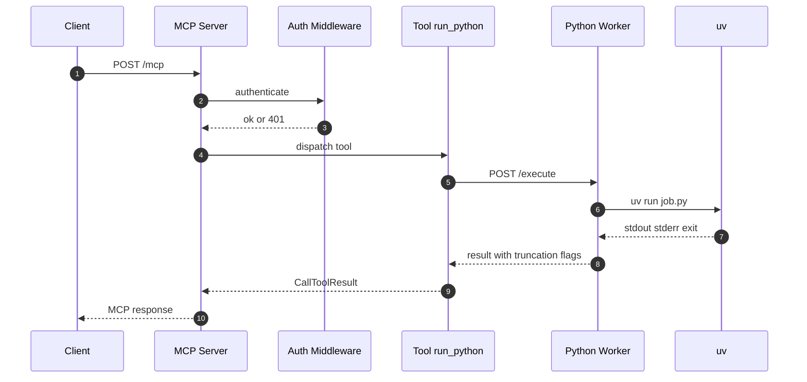

# Python 执行沙箱拆分与安全限制方案（codebox-rmcp）

本文档面向 [`codebox-rmcp`](README.md:1) 项目，讨论将 Python 代码执行模块从主服务容器中拆分到独立执行容器（Worker）并进行安全加固的方案。

> 范围说明：本文仅做架构方案讨论与推荐，不包含实际实现与上线操作。

---

## 0. 背景与现状

当前为**单容器**架构：认证 + MCP 路由 + Python 执行器全部在同一容器内运行。

- Python 执行器：[`execute_python()`](src/executor.rs:48) 将用户代码写入临时文件，随后 `uv run <temp.py>` 执行并捕获 stdout/stderr。
- MCP 工具：[`PythonRunner::run_python()`](src/tools.rs:51) 调用 [`execute_python()`](src/executor.rs:48) 并返回 JSON 文本。
- 认证：[`auth_middleware()`](src/auth.rs:42) 读取 `AUTH_TOKENS` 并校验 Bearer Token。
- 服务路由：[`run_server()`](src/server.rs:23) 将 `/mcp` 置于鉴权中间件之后。
- 容器：[`Dockerfile`](Dockerfile:1) 运行时镜像里同时包含 Rust 主服务 + Python3 + uv。

### 已识别安全问题（现状）

1. Python 代码在主服务同一容器内以 root 运行，无沙箱隔离
2. 子进程继承全部环境变量（含 `AUTH_TOKENS`）
3. 执行环境具备完整出站网络能力
4. 无 CPU/内存/输出大小限制
5. 子进程可能遗留孤儿进程
6. Python 代码可访问主服务的文件系统

---

## 1. 威胁模型与目标

### 1.1 威胁模型（简化）

攻击者能力：可通过 MCP 调用提交任意 Python 代码，并可重复尝试。

潜在攻击面包括但不限于：

- 读写主服务容器文件系统、读取配置与密钥（如 `AUTH_TOKENS`）
- 通过网络访问内网资源、扫描、SSRF、数据外传
- 资源耗尽（CPU 自旋、内存爆炸、输出洪泛、fork bomb、文件写满）
- 逃逸链条（容器逃逸、内核漏洞利用、capabilities 滥用）
- 子进程不受控导致的僵尸/孤儿进程累积

### 1.2 安全目标

优先级从高到低：

1. **机密性隔离**：Python 执行环境不应能读取主服务的环境变量、配置、文件系统。
2. **网络隔离**：默认无出站或严格白名单，避免把 Worker 当成跳板。
3. **资源上限**：CPU/内存/PID/磁盘/输出大小可控，避免 DoS。
4. **可终止性**：超时或超限能可靠终止相关进程（含子进程树）。
5. **最小化攻击面**：最小镜像、最少依赖、最少权限、可观测性与审计。

### 1.3 非目标（建议明确）

- 不保证对 Python 本身的“语言级完全沙箱”（Python 无可靠内置沙箱）。
- 不在本阶段引入复杂的多租户计费、配额中心、分布式调度（可作为后续演进）。

---

## 2. 容器拆分架构

### 2.1 拆分边界

建议拆为两个（或三个）角色：

1. **主服务容器（MCP Server）**
   - 负责：鉴权、MCP 协议适配、请求校验、速率限制、日志审计。
   - 不包含：Python、uv、执行依赖。
   - 不直接运行用户代码。

2. **执行容器（Python Worker）**
   - 负责：在受限环境中执行 Python 代码，捕获输出并返回。
   - 只暴露内部接口给主服务（不对公网暴露）。
   - 运行权限与网络最小化。

3. （可选）**沙箱管理器（Sandbox Manager）**
   - 负责：每次执行创建/销毁短生命周期容器或 microVM，并收集输出。
   - 用于“每次执行一容器”模式避免主服务直接持有 Docker Socket。

### 2.2 通信方式对比

下表假设运行环境以 Docker Compose 为主（单机），但也尽量兼容 K8s 演进。

| 通信方式 | 适用场景 | 优点 | 缺点 / 风险 | 推荐度 |
|---|---|---|---|---|
| 内部 HTTP JSON API | Compose 内部网络、快速落地 | 实现简单；可直连；易调试；可超时 | 需设计鉴权与重试；输出大时需考虑限制 | 高 |
| gRPC | 需要强类型接口、流式输出 | 强类型；流式/双向；高性能 | 引入 proto/生成流程；调试成本更高 | 中 |
| 消息队列（Redis/RabbitMQ/NATS） | 高并发、任务排队、异步执行 | 背压与排队好；易扩 Worker | 增加组件与运维；结果回传复杂 | 中 |
| Unix Domain Socket（bind mount） | 同机、追求更小攻击面 | 不走 TCP；可用文件权限控制 | 容器间挂载复杂；跨主机不可用 | 中 |
| Docker API（挂载 docker.sock） | “每次执行一容器”且无需额外调度系统 | 容器级隔离最强；无需常驻 Worker 逻辑 | **docker.sock 等同 root**；主服务一旦被利用可控宿主机 | 低（除非引入隔离代理） |

结论（Compose 优先）：先落地 **内部 HTTP Worker**，再按需求演进到队列或更强隔离。

### 2.3 Worker 常驻 vs 每次执行创建/销毁

#### 方案 A：Worker 常驻服务（推荐作为第一阶段）

- 主服务通过内部网络调用 Worker `POST /execute`。
- Worker 内部用 `uv run` 执行脚本并返回输出。

优点：

- 架构简单；无需访问 Docker API；易于在 Compose 中编排。
- 可复用 `uv` 缓存（依赖安装更快，磁盘可控时收益明显）。

缺点：

- 隔离粒度为“进程级”（在同一 Worker 容器内隔离）；同一容器内多个执行之间可能通过残留文件、缓存产生侧信道。
- 需要额外治理：每次执行的临时目录隔离、清理、并发限制。

#### 方案 B：每次执行创建/销毁容器（更强隔离）

- 每次请求启动一个短生命周期容器执行脚本，结束即销毁。

优点：

- 隔离边界更强；文件系统与进程命名空间天然隔离；“清理”更彻底。

缺点：

- **编排复杂**：需要 Docker API/K8s Job/自建调度。
- 性能与启动成本更高；依赖下载会更慢（可用镜像预烘焙或缓存卷缓解）。

折中：引入“沙箱管理器”以避免主服务直接拿到 Docker socket。

---

## 3. 执行容器的安全加固（Worker 侧）

本节假设 Worker 自己负责执行 `uv run`。即使后续演进到每次执行一容器，下面策略仍大多适用（会迁移到“执行容器模板”中）。

### 3.1 非 root 用户运行

- Worker 镜像内创建专用用户，例如 UID/GID 10001。
- Compose 中显式 `user: 10001:10001`。

效果：降低容器内提权后的破坏面（仍需配合 capability/seccomp 等）。

### 3.2 只读文件系统 + tmpfs

- `read_only: true`：根文件系统只读。
- `tmpfs`：提供必要的可写目录，例如 `/tmp`、`/home/worker/.cache`。
- 将每次执行的脚本写入 `/tmp/job/<id>/main.py`，执行结束清理。

效果：限制落盘与持久化；减少植入与后门。

### 3.3 网络隔离策略

分为三档：

1. **完全隔离（默认推荐）**
   - Worker 容器 `network_mode: none` 或仅加入 internal network 且无出站。
   - 前提：不允许运行时拉取依赖（`uv` 依赖需预置）。

2. **受控出站（白名单）**
   - 允许 Worker 出站访问少量域名（例如包仓库、内部镜像源）。
   - Docker 原生不提供 L7 白名单，需要借助：
     - eBPF/防火墙（宿主机 iptables/nftables）
     - 代理模式（Worker 只允许访问出站代理，代理做域名白名单）
     - Service Mesh / egress gateway（K8s 更常见）

3. **完全开放（不推荐）**
   - 仅适用于受信环境或离线网络，不满足多数安全要求。

与 `uv` 依赖的关系：

- 如果 `run_python` 允许用户声明依赖（见 [`PythonRunner::run_python()`](src/tools.rs:51) 的 examples），则“完全无网”将导致依赖无法下载。
- 安全与可用性的折中路径：
  - 只允许访问内部 PyPI mirror（推荐）
  - 或禁用动态依赖，仅允许预装的库集合

本文档已确认的偏好（面向当前项目的阶段性选择）：

- **允许网络访问与依赖下载**，但建议按“受控出站（白名单）”落地：
  - Worker 仅允许访问出站代理或内部 PyPI mirror
  - 禁止直连任意公网地址

### 3.4 资源限制

建议同时在容器层与进程层做限制（防御纵深）。

容器层（Compose 示例字段，实际可用性取决于 Docker/Compose 版本）：

- CPU：`cpus: 0.5` 或 `cpu_quota`
- 内存：`mem_limit: 256m`（或 `deploy.resources.limits.memory`）
- PID：`pids_limit: 128`
- 进程文件句柄：`ulimits.nofile`（避免句柄耗尽）
- 磁盘：优先只读根 + tmpfs 限额；必要时配合 `--storage-opt`（依赖运行时能力）

进程层（Worker 执行器内）：

- 超时：复用现有 [`timeout()`](src/executor.rs:96) 思路，但需要对**进程组**执行 kill。
- 并发度：Worker 端加 semaphore 限制并发执行数，避免单容器过载。

### 3.5 seccomp / AppArmor / capabilities

建议配置：

- `security_opt: [no-new-privileges:true]`
- `cap_drop: [ALL]`，按需 `cap_add`（通常不需要任何 capability）
- `security_opt: [apparmor:PROFILE_NAME]`（Ubuntu/Debian 常见）
- `seccomp`：
  - 起步用 Docker 默认 seccomp profile
  - 进阶自定义 seccomp 白名单，进一步收敛系统调用

注意：

- 自定义 seccomp/AppArmor 需要宿主机支持与运维配合。
- 对 Python/uv 来说，过严的 seccomp 可能导致不可预期失败，需要压测与逐步收敛。

### 3.6 init 进程与孤儿进程治理

容器内建议启用 init：

- Compose：`init: true`（等价于 `docker run --init`）

Worker 内执行时建议：

- 让每次执行在独立的进程组中运行，并在超时/超限时 kill 整个进程组。
- 若 Worker 仅能 kill 主进程，子进程可能变为孤儿并继续运行。

---

## 4. 代码层面的改动（重构方向）

目标：把“执行 Python”从本地子进程调用改为“远程调用 Worker”，但保持 `tools.rs` 的接口形态尽量稳定。

### 4.1 `executor.rs` 的重构思路

当前 [`execute_python()`](src/executor.rs:48) 是“本地执行器”。建议演进为“执行器抽象 + 两种实现”：

- `LocalUvExecutor`：保留现有逻辑（用于开发或回退）。
- `RemoteWorkerExecutor`：通过 HTTP/gRPC 调用 Worker。

Rust 侧形态可以是 trait（或 enum + match）：

- [`ExecutionResult`](src/executor.rs:10) 保持不变或扩展字段（例如 `truncated: bool`、`duration_ms`）。

`RemoteWorkerExecutor` 的关键差异点：

- 不再写临时文件、不再 spawn `uv`。
- 负责：请求序列化、超时、重试策略（慎用）、错误映射、输出大小二次校验。

### 4.2 是否需要新增模块

建议新增：

- `src/worker_client.rs`：定义 Worker API 客户端、请求/响应结构体。
- `src/execution_limits.rs`：统一定义超时、输出上限、并发上限等（主服务与 Worker 可共享配置键）。

可选新增（中等复杂度方案）：

- `src/queue.rs`：任务排队与背压（若引入 Redis/NATS）。
- `src/audit.rs`：记录请求元数据（token 关联、hash、执行时长、截断情况）。

### 4.3 执行结果回传设计

建议 Worker 返回结构化 JSON：

- `stdout`: string
- `stderr`: string
- `exit_code`: int
- `truncated`: bool（任一输出被截断）
- `duration_ms`: int

对于 MCP 的返回（当前 [`PythonRunner::run_python()`](src/tools.rs:51)）可以保持 JSON 文本输出不变，仅在 payload 中增加字段。

### 4.4 输出大小限制的实现

推荐“双层限制”：

1. **Worker 层强制截断**（首选，避免网络与内存放大）
   - 读取 stdout/stderr 时按字节数累计，超过 `MAX_OUTPUT_BYTES` 立即：
     - 停止读取并 kill 进程组，或
     - 继续读但丢弃（不推荐，浪费资源）
   - 返回时带 `truncated=true` 并附带被截断前的内容。

2. **主服务层二次校验**
   - 防止 Worker Bug 或被绕过导致返回超大响应。

实现要点（Worker 内部执行器）：

- 不要使用 [`read_to_end()`](src/executor.rs:81) 这类无上限读取。
- 改为循环读取固定 buffer，并维护计数；必要时对 stdout/stderr 合并计算总量。

---

## 5. 容器编排（docker-compose）

### 5.1 目标编排形态

从当前单服务 [`docker-compose.yml`](docker-compose.yml:1) 演进为至少两个服务：

- `mcp-server`：对外暴露端口；仅持有 `AUTH_TOKENS`。
- `python-worker`：不对外暴露端口；不持有 `AUTH_TOKENS`；强约束。

建议使用自定义网络：

- `public`：仅 `mcp-server` 加入并对外映射。
- `sandbox`：internal network，仅 `mcp-server` 与 `python-worker` 通信。

Worker 端口只在 `sandbox` 网络内暴露，避免被外部直接访问。

#### docker-compose 片段（示意）

> 说明：此片段用于表达关键安全字段与网络拓扑，字段在不同 Compose/Docker 版本中的支持度需要在实施时校验。

```yaml
services:
  mcp-server:
    image: codebox-rmcp-server:latest
    ports:
      - "18081:18081"
    env_file:
      - .env
    environment:
      # 指向内部 worker
      WORKER_URL: http://python-worker:9000
    networks:
      - public
      - sandbox

  python-worker:
    image: codebox-rmcp-worker:latest
    expose:
      - "9000"
    networks:
      - sandbox
    # 关键：非 root
    user: "10001:10001"
    # 关键：只读根文件系统
    read_only: true
    tmpfs:
      - /tmp:rw,noexec,nosuid,size=256m
      - /home/worker/.cache:rw,nosuid,size=512m
    # 关键：最小权限
    cap_drop:
      - ALL
    security_opt:
      - no-new-privileges:true
    # 关键：进程回收，避免僵尸
    init: true
    # 关键：资源限制（字段可用性与效果需验证）
    mem_limit: 512m
    cpus: 1.0
    pids_limit: 256

networks:
  public: {}
  sandbox:
    internal: true
```

### 5.2 Worker 镜像设计（最小化攻击面）

建议原则：

- 只包含执行所需：Python3 + uv + 最小系统依赖。
- 非 root 用户。
- 默认只读 rootfs。
- 预置常用依赖（可选），减少运行时下载。

主服务镜像原则：

- 不包含 Python/uv，降低被利用后的横向能力。
- 可考虑更小基础镜像（distroless）以减少漏洞面（需评估 glibc/openssl 依赖）。

### 5.3 配置与密钥

建议将敏感配置只注入到 `mcp-server`：

- `AUTH_TOKENS` 仅存在于主服务容器。
- Worker 仅接收执行参数与限制参数（timeout/output limit），避免携带任何凭证。

---

## 6. 可选的更高级隔离方案

### 6.1 gVisor (runsc)

适用：

- 仍使用容器工作流，但希望获得更强的内核隔离（用户态内核拦截）。

优点：

- 相对易接入（取决于宿主机与 Docker runtime 支持）。
- 对容器逃逸类风险有显著缓解。

缺点：

- 兼容性与性能开销需要评估；某些 syscalls/特性可能受限。
- 运维需要安装与配置 runsc；Compose 字段支持情况需验证。

建议用法：先对 `python-worker` 启用 runsc，主服务保持默认 runtime。

### 6.2 Firecracker microVM / Kata Containers

适用：

- 强隔离需求（接近 VM 隔离），尤其是多租户或高风险代码执行。

优点：

- 更强的内核隔离边界（microVM）。

缺点：

- 复杂度显著上升：需要 KVM、运行时、镜像格式、调度与日志收集。
- 本地 Compose 形态通常不够，需要 K8s + Kata 或专用编排。

建议：作为“完整方案”的后续演进路径，而非第一阶段。

---

## 7. 方案对比与推荐

本节给出 3 个不同复杂度档位，并给出推荐实施路径。

### 7.0 总览对比

| 方案 | 延迟 | 隔离强度 | 实现复杂度 | 运维复杂度 | 典型通信 | 适用 |
|---|---|---|---|---|---|---|
| S 双容器 常驻 Worker | 低（无冷启动） | 中（容器级隔离 + 进程级执行） | 低 | 低-中 | 内部 HTTP | 延迟敏感、单机/小规模 |
| M 队列 常驻 Worker 池 | 中（排队影响） | 中 | 中 | 中-高 | MQ + Worker 拉取 | 需要背压与扩展 |
| F 每次执行一隔离单元 | 高（冷启动） | 高（强隔离） | 高 | 高 | Docker API/K8s Job/VM | 多租户/高风险/合规 |

### 7.1 方案 S（简单）：双容器 + 常驻 Worker（内部 HTTP）

**架构**：

- `mcp-server` 调用 `python-worker` 的内部 HTTP API。
- Worker 容器进行安全加固：非 root、只读 rootfs、tmpfs、cap_drop、pids/mem/cpu 限制、init。
- 网络策略：**允许依赖下载但做受控出站**（仅允许访问出站代理或内部 PyPI mirror）。

**优点**：

- 改动面可控；无需 Docker socket；适合 Compose。
- 立刻解决“环境变量泄露/文件系统同容器”的核心问题。

**缺点**：

- 隔离粒度仍在同一 Worker 容器内；需要做好每次执行的目录隔离与清理。

**推荐场景**：

- 单机部署、对延迟敏感、希望复用常驻 Worker 来减少冷启动开销。

### 7.2 方案 M（中等）：常驻 Worker + 队列 + 严格背压

**架构**：

- `mcp-server` 写入任务队列，Worker 从队列拉取并执行。
- Worker 可水平扩展；队列提供背压与排队。

**优点**：

- 更好的负载治理与弹性；可对不同 token/租户做速率限制（需额外实现）。

**缺点**：

- 引入队列组件与运维；结果回传与超时语义更复杂。

**推荐场景**：

- 并发较高、需要排队、需要多 Worker 扩展。

### 7.3 方案 F（完整）：每次执行一隔离单元（容器或 microVM）

**架构**：

- 引入 `sandbox-manager` 负责启动短生命周期执行单元（容器、runsc 容器、Kata/Firecracker microVM）。
- `mcp-server` 仅调用 `sandbox-manager`，不接触 docker.sock。

**优点**：

- 隔离最强；清理最彻底；适合高风险与多租户。

**缺点**：

- 复杂度与运维成本最高；性能开销与冷启动明显。

**推荐场景**：

- 面向不受信租户、合规要求高、必须尽量降低逃逸风险。

### 7.4 推荐实施路径

建议分阶段推进（不做工期估算）：

1. 先落地 **方案 S**：拆分容器 + Worker 安全加固 + 输出限制 + 不泄露环境变量。
2. 若出现并发/背压问题，再升级到 **方案 M**（队列）。
3. 若隔离强度仍不足，再评估 **方案 F**（runsc/Kata/Firecracker）。

---

## 8. 建议的时序图（方案 S）



---

## 9. 待确认的关键决策（用于实施前对齐）

1. 依赖策略（已确认）：
   - 支持脚本顶部声明依赖并在运行时下载（`uv` 在线安装/解析）。
   - 需要配套“受控出站”与缓存策略（建议内部 PyPI mirror 或出站代理）。

2. 隔离粒度（已确认）：
   - 先做常驻 Worker 容器（内部 HTTP），以降低延迟；后续按风险与并发再演进。

3. 预期并发与单次输出上限是多少？
   - 影响 Worker 并发限制、队列是否必要、输出截断策略。

4. 部署形态是否仅 Docker Compose 单机，还是未来会迁移 K8s？
   - 影响通信方式与高级隔离（runsc/Kata）的可行性。

---

## 10. Worker API 草案（方案 S：内部 HTTP）

目标：让主服务将执行请求“远程化”，并把限制（timeout/output/max concurrency）下沉到 Worker。

### 10.1 Endpoint

- `POST /execute`

### 10.2 Request（JSON）

字段建议：

- `code: string`（必填）
- `timeout_ms: number`（可选；Worker 侧设置上限，例如最大 60s 或 120s）
- `max_output_bytes: number`（可选；Worker 侧设置上限，例如默认 64KB/256KB）
- `network: object`（可选；若未来支持策略切换，例如 allowlist profile 名称）

建议主服务不要把任何凭证传给 Worker（如 token、用户 header）。Worker 仅需要执行输入与限制。

### 10.3 Response（JSON）

- `stdout: string`
- `stderr: string`
- `exit_code: number`
- `truncated: boolean`
- `duration_ms: number`
- `killed: boolean`（是否因超时/超限被终止）

### 10.4 错误语义与状态码

- `200 OK`：成功执行并返回结果（即使 `exit_code != 0` 也返回 200，保持与当前 [`execute_python()`](src/executor.rs:48) 的语义一致）。
- `400 Bad Request`：请求字段非法（例如 `code` 为空或过大）。
- `429 Too Many Requests`：Worker 并发已满（用于背压）。
- `500 Internal Server Error`：Worker 内部错误（uv 不存在、spawn 失败等）。

### 10.5 超时与进程终止

- Worker 必须能终止“进程树”，避免只 kill 主进程导致子进程遗留。
- 对应到实现建议：使用进程组/会话，并在超时后 kill group（细节留到实现阶段）。

---

## 11. 受控出站的落地选项（允许依赖下载前提）

你已确认 Worker 需要网络访问并允许依赖下载，因此关键问题变为：如何避免 Worker 任意访问外网。

### 11.1 出站代理模式（推荐优先）

思路：

- Worker 容器网络仍为 `sandbox` internal。
- 在 `sandbox` 网络内增加一个 `egress-proxy`（例如 Squid/Tinyproxy/自建 HTTP CONNECT 代理）。
- 宿主机层面只允许 Worker 访问 proxy 的地址与端口；proxy 再按域名白名单放行（例如仅 PyPI mirror 域名）。

优点：

- 白名单控制集中；易审计与记录。
- 可在 proxy 侧做限速、缓存（加速依赖下载）。

缺点：

- 需要额外组件与配置；对 HTTPS 域名白名单需要 SNI/CONNECT 策略，复杂度取决于代理能力。

### 11.2 内部 PyPI mirror（推荐长期形态）

思路：

- 在内网/同机提供 PyPI mirror（devpi、bandersnatch、pypiserver 等）。
- Worker 只允许访问 mirror（配合 DNS 固定与网络 ACL）。

优点：

- 大幅减少对公网依赖；可做包审计与缓存。

缺点：

- 需要运维 mirror；需要考虑同步与存储。

### 11.3 宿主机防火墙/网络策略（实现但运维依赖宿主机）

思路：

- 在宿主机上对 Worker 容器 IP/网桥做 iptables/nftables 规则。

优点：

- 不必引入代理组件。

缺点：

- 规则维护与可移植性差；在不同宿主机/平台差异大；可观测性弱。

结论：

- Compose 单机：优先“出站代理 +（可选）内部 mirror”，再用宿主机防火墙做兜底。

---

## 12. `executor` 模块边界草图（主服务侧）

目标：让 [`PythonRunner::run_python()`](src/tools.rs:51) 不关心执行是本地还是远程。

建议结构：

- `executor` 模块只暴露统一接口（trait 或 enum），返回 [`ExecutionResult`](src/executor.rs:10)。
- `local_uv` 实现复用现有逻辑（开发/回退）。
- `remote_worker` 实现通过 `worker_client` 调用 Worker。

配置建议：

- `EXECUTION_MODE=local|remote`
- `WORKER_URL=http://python-worker:9000`
- `MAX_OUTPUT_BYTES=262144`
- `WORKER_MAX_CONCURRENCY=...`（Worker 端）

主服务还应做：

- 请求大小限制（防止超大 `code` 体积）
- 速率限制（按 token/IP）
- 审计日志（hash、长度、耗时、截断、错误类型）
