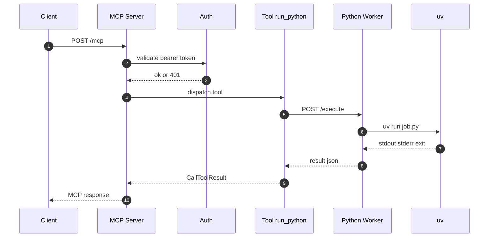

# codebox-rmcp 安全升级方案：双容器拆分 + RPC 通信

本文档给出 [`codebox-rmcp`](../README.md:1) 的安全升级方案：将 MCP 主服务与 Python 执行环境拆分为两个独立容器，通过内部 RPC（推荐 HTTP JSON，可选 gRPC）通信，并对执行容器做容器级加固。

参考现状与已有分析：[`docs/architecture.md`](../docs/architecture.md:1)、[`docs/security-sandbox-design.md`](../docs/security-sandbox-design.md:1)。

---

## 0. 背景与问题陈述

当前实现为单容器：MCP 服务（认证 + 路由）与 Python 执行器在同一容器内运行，且执行链路在 [`execute_python()`](../src/executor.rs:48) 中直接使用 `uv run` 启动子进程。

关键安全问题（与现状源码对应）：

- 执行进程与主服务同容器：Python 可读取主服务文件系统与环境变量（含 `AUTH_TOKENS`，见 [`TokenStore::from_env()`](../src/auth.rs:16)）。
- 执行以 root 运行（当前镜像运行时默认 root，见 [`Dockerfile`](../Dockerfile:1)）。
- 缺少容器级资源限制与网络隔离（`docker-compose` 仅启动单服务，见 [`docker-compose.yml`](../docker-compose.yml:1)）。
- 输出读取无上限：[`read_to_end()`](../src/executor.rs:81) 可能导致内存放大与 DoS。

---

## 1. 架构总览

### 1.1 新旧架构对比

旧架构（单容器）：


新架构（双容器 + 内部 RPC）：


### 1.2 两个容器职责划分

**MCP 服务容器（主容器）**

- 对外暴露：`/mcp`（受 Bearer Token 保护，见 [`auth_middleware()`](../src/auth.rs:42) 与 [`run_server()`](../src/server.rs:23)）。
- 负责：鉴权、MCP 协议处理、参数校验、任务下发、结果封装。
- 不再包含：`python3`、`uv`、执行依赖。
- 不再执行：本地 `uv run`。

**Python Worker 容器（执行容器）**

- 对外不暴露端口，仅加入内部网络。
- 负责：提供 RPC 接口（HTTP 或 gRPC），接收 `code + timeout`，执行并返回 `stdout/stderr/exit_code`。
- 常驻服务模式：复用进程与（可选）uv 缓存，避免每次创建销毁容器。

### 1.3 通信流程图（推荐方案：HTTP JSON）



---

## 2. MCP 服务容器（主容器）设计

### 2.1 职责

主容器继续沿用当前 axum + rmcp 结构：

- MCP 路由与鉴权保持：[`run_server()`](../src/server.rs:23)、[`auth_middleware()`](../src/auth.rs:42)。
- MCP tool 保持 `run_python`：[`PythonRunner::run_python()`](../src/tools.rs:51)。

变化点：

- [`execute_python()`](../src/executor.rs:48) 从“本地子进程执行”改为“RPC 调用 Worker”。

### 2.2 主容器新增/调整的安全措施

- **输入限制**：限制 `code` 长度（字节数），并在 HTTP 层限制请求体大小（避免超大 MCP 请求导致内存放大）。
- **最小化依赖**：运行时镜像不包含 `python3/uv`，减少可利用能力与漏洞面。
- **请求追踪与审计**：记录 `code` 的 hash、长度、timeout、worker 返回的截断标记（不记录明文代码，避免敏感信息二次泄露）。

---

## 3. Python Worker 容器（执行容器）设计

### 3.1 Worker 运行形态

满足“常驻、可复用”的前提下，推荐 Worker 作为**常驻 HTTP 服务**：

- 进程内实现并发上限（Semaphore）与队列背压（返回 429）。
- 每次执行在独立临时目录写入脚本，并在执行后清理。

### 3.2 安全加固清单（必须项）

1. **非 root 用户运行**
   - 镜像中创建固定 UID/GID（例如 10001）并使用 `USER`。
   - Compose 中可叠加 `user: 10001:10001` 做强制。

2. **只读根文件系统 + tmpfs**
   - `read_only: true`。
   - `tmpfs: /tmp` 用于写入脚本与运行时临时文件。
   - 如果允许 uv 缓存，可将 cache 目录挂到 tmpfs 或受控 volume（见 5.4）。

3. **环境变量清空（不含敏感信息）**
   - 容器层面：Worker 不注入 `AUTH_TOKENS`。
   - 进程层面：Worker 在 spawn `uv` 时使用 `env_clear`，只注入必要变量（如 `PATH`、`HOME`、`UV_CACHE_DIR`）。

4. **资源限制**
   - CPU/内存/PID 上限（Compose 字段视 Docker 版本而定）。
   - Worker 内部并发上限（例如 `WORKER_MAX_CONCURRENCY`）。

5. **最小化镜像**
   - 仅包含：Worker 服务二进制 + `python3` + `uv` + 必要证书。
   - 主容器不包含 Python 运行时。

### 3.3 安全加固清单（推荐项）

- `cap_drop: [ALL]` + `no-new-privileges:true`。
- `init: true`（回收僵尸进程）。
- `ulimits`（nofile 等）。
- 可选 AppArmor/seccomp 收敛（先用 Docker 默认 seccomp，逐步收紧）。

---

## 4. RPC 通信设计

### 4.1 gRPC vs HTTP JSON：对比与推荐

| 维度 | HTTP JSON（建议第一阶段） | gRPC tonic（可选第二阶段） |
|---|---|---|
| 落地复杂度 | 低：axum 直接 JSON | 中：引入 proto、生成与反射/调试 |
| 可调试性 | 高：curl 即可 | 中：需要 grpcurl 或客户端 |
| 类型约束 | 运行时校验 | 强类型、兼容性更清晰 |
| 流式输出 | 不方便 | 支持 server streaming |
| 适合本项目 | 是：强调简单实用 | 仅在需要流式/强类型时 |

**推荐**：第一阶段使用 **HTTP JSON API**，后续若需要“流式输出/更强类型契约”再迁移到 tonic gRPC。

### 4.2 统一的请求/响应语义

无论 HTTP 或 gRPC，都保持同一语义：

- 请求：`code: string`，`timeout: u64`
- 响应：`stdout: string`，`stderr: string`，`exit_code: i32`，`error: optional string`

建议补充字段（不破坏现有 MCP 返回 JSON 文本的兼容性）：

- `truncated: bool`（输出是否截断）
- `duration_ms: u64`
- `killed: bool`（是否被超时/超限终止）

### 4.3 HTTP JSON API 设计（推荐）

Endpoint：

- `POST /execute`

Request JSON：

```json
{
  "code": "print(1)",
  "timeout": 60
}
```

Response JSON（200）：

```json
{
  "stdout": "1\n",
  "stderr": "",
  "exit_code": 0,
  "error": null,
  "truncated": false,
  "duration_ms": 12,
  "killed": false
}
```

错误语义建议：

- `200 OK`：成功执行并返回结构化结果（即使 `exit_code != 0` 也返回 200，保持当前 [`execute_python()`](../src/executor.rs:48) 的语义）。
- `400`：参数非法（空 code / 超长）。
- `429`：并发已满（背压）。
- `500`：Worker 内部错误（uv 不存在、spawn 失败、无法清理等）。

### 4.4 gRPC .proto 定义（可选）

建议文件：[`proto/python_worker.proto`](../proto/python_worker.proto:1)

```proto
syntax = "proto3";

package codebox.worker.v1;

service PythonWorker {
  rpc Execute(ExecuteRequest) returns (ExecuteResponse);
}

message ExecuteRequest {
  string code = 1;
  uint64 timeout = 2;
}

message ExecuteResponse {
  string stdout = 1;
  string stderr = 2;
  int32 exit_code = 3;
  string error = 4;
  bool truncated = 5;
  uint64 duration_ms = 6;
  bool killed = 7;
}
```

### 4.5 内部认证：是否需要与最简实现

**原则**：Worker 只在内部网络暴露，仍建议增加“轻量内部认证”以降低同网络横向调用风险。

最简可用方案：

- MCP 主容器与 Worker 容器共享一个独立 secret：`WORKER_RPC_TOKEN`。
- 主容器调用时附带 `Authorization: Bearer <WORKER_RPC_TOKEN>`。
- Worker 校验该 token。

注意：

- `WORKER_RPC_TOKEN` 必须与对外的 `AUTH_TOKENS` 隔离（两者用途不同）。
- Worker 不应持有任何对外认证 token（如 `AUTH_TOKENS`）。

---

## 5. 网络隔离设计

### 5.1 Docker 自定义网络

推荐三张网络（职责拆分更清晰）：

- `public`：仅主容器加入并对外映射端口。
- `sandbox`：仅承载主容器与 Worker 的内部 RPC（建议 `internal: true`）。
- `egress`：Worker 访问互联网（下载依赖）。

### 5.2 Worker 端口暴露策略

- Worker 使用 `expose` 而非 `ports`，避免宿主机端口映射。
- Worker 服务监听 `0.0.0.0:9000` 但仅在 `sandbox` 网络可达。

### 5.3 Worker 出站网络策略（本次选择：允许出站，不做流量约束）

你已确认：**仍然允许依赖下载，且暂不约束 Worker 的出站流量**。因此本阶段的网络隔离目标收敛为：

- Worker **不对公网暴露入口**（无 `ports` 映射，仅 `expose` 在内部网络可达）。
- Worker **允许访问外网**（用于 `uv` 拉取依赖）。

落地方式（Compose）：

- `sandbox` 网络用于主容器与 Worker 的 RPC（可配置为 `internal: true`，仅承载东西向）。
- Worker 额外加入一个非 internal 的 `egress` 网络以访问互联网。

安全影响（必须在文档中明确）：

- 这会保留“把 Worker 当跳板进行扫描/外传”的风险。
- 本方案通过**资源限制与最小权限**先缓解 DoS 与容器内提权面，但**不解决**网络滥用。

后续可演进方向（不影响本阶段落地）：

- 引入“出站代理/内部 PyPI mirror”实现域名白名单；或在宿主机层面做 ACL。

---

## 6. Rust 代码改动清单（主服务与 Worker）

### 6.1 `src/executor.rs` 如何改造

当前 [`execute_python()`](../src/executor.rs:48) 是本地执行器，建议演进为“执行器抽象 + 两种实现”：

- `LocalUvExecutor`：保留现有逻辑（开发/回退）。
- `RemoteWorkerExecutor`：RPC 调用 Worker。

关键改动点：

- **移除无上限读取**：替换 [`read_to_end()`](../src/executor.rs:81) 为有上限读取（在 Worker 侧优先实现，主侧二次校验）。
- **超时与 kill**：Worker 侧对“进程树”执行终止（Unix 下用进程组/setsid 思路）。

### 6.2 是否需要新增模块

建议新增：

- [`src/worker_client.rs`](../src/worker_client.rs:1)：封装 HTTP/gRPC 客户端、请求/响应结构。
- [`src/execution_limits.rs`](../src/execution_limits.rs:1)：统一配置键与默认值（timeout、max_code_bytes、max_output_bytes、并发等）。

### 6.3 `src/tools.rs` 的改动

目标是让 [`PythonRunner::run_python()`](../src/tools.rs:51) 不关心“本地还是远程”。推荐做法：

- `PythonRunner` 持有一个 `Executor` 抽象（trait 或 enum）。
- tool 仅调用 `executor.run(code)` 并把结果封装为 MCP JSON 文本。

### 6.4 Worker 端实现：Rust 二进制 vs Python 服务

两种可行实现：

**方案 W1：独立 Rust Worker 二进制（推荐）**

- 优点：复用现有 Rust 执行逻辑（由 [`execute_python()`](../src/executor.rs:48) 抽出本地实现）；统一日志与错误语义；依赖更少。
- 缺点：Worker 镜像需要包含 Rust 编译产物（但运行时仍可很小）。

**方案 W2：Python Worker 服务**

- 优点：Worker 端实现简单直观。
- 缺点：需要额外 Python Web 框架或自行写 HTTP server；运维依赖增加；与 Rust 主服务共享结构体/语义更难。

结论：为保持“简单实用 + 最小组件数”，推荐 **W1 Rust Worker 二进制**。

### 6.5 建议的新模块结构图

```text
src/
  lib.rs
  auth.rs
  server.rs
  tools.rs
  execution_limits.rs
  executor/
    mod.rs
    local_uv.rs
    remote_worker.rs
  worker_client.rs
  bin/
    codebox-rmcp-server.rs
    codebox-rmcp-worker.rs
```

说明：可保留现有 [`src/main.rs`](../src/main.rs:1) 作为 server bin，Worker 新增到 `src/bin`。

---

## 7. Docker 配置改动（完整示例）

### 7.1 新的 Dockerfile（主服务）

建议文件：[`Dockerfile.server`](../Dockerfile.server:1)

目标：运行时镜像不包含 `python3/uv`。

```dockerfile
# syntax=docker/dockerfile:1

FROM rust:1.88-bookworm AS builder
WORKDIR /app
COPY Cargo.toml Cargo.lock ./
COPY src ./src
RUN --mount=type=cache,target=/usr/local/cargo/registry \
    --mount=type=cache,target=/usr/local/cargo/git \
    --mount=type=cache,target=/app/target \
    cargo build --release --locked

FROM debian:bookworm-slim AS runtime
WORKDIR /app
RUN apt-get update \
    && apt-get install -y --no-install-recommends ca-certificates \
    && rm -rf /var/lib/apt/lists/*
COPY --from=builder /app/target/release/codebox-rmcp /usr/local/bin/codebox-rmcp
ENV SERVER_HOST=0.0.0.0
ENV SERVER_PORT=8080
EXPOSE 8080
CMD ["codebox-rmcp"]
```

### 7.2 新的 Dockerfile.worker（执行容器）

建议文件：[`Dockerfile.worker`](../Dockerfile.worker:1)

目标：仅包含 Worker 二进制 + Python/uv 运行时；非 root。

```dockerfile
# syntax=docker/dockerfile:1

FROM rust:1.88-bookworm AS builder
WORKDIR /app
COPY Cargo.toml Cargo.lock ./
COPY src ./src
RUN --mount=type=cache,target=/usr/local/cargo/registry \
    --mount=type=cache,target=/usr/local/cargo/git \
    --mount=type=cache,target=/app/target \
    cargo build --release --locked

FROM debian:bookworm-slim AS runtime
WORKDIR /app

RUN apt-get update \
    && apt-get install -y --no-install-recommends \
        ca-certificates \
        curl \
        python3 \
    && rm -rf /var/lib/apt/lists/*

RUN curl -LsSf https://astral.sh/uv/install.sh | sh

# 创建非 root 用户
RUN useradd -u 10001 -m -s /usr/sbin/nologin worker

ENV PATH="/home/worker/.local/bin:${PATH}"
ENV HOME=/home/worker

COPY --from=builder /app/target/release/codebox-rmcp-worker /usr/local/bin/codebox-rmcp-worker

USER 10001:10001

EXPOSE 9000
CMD ["codebox-rmcp-worker"]
```

### 7.3 新的 docker-compose.yml（双服务 + 网络 + 安全参数）

建议文件：[`docker-compose.yml`](../docker-compose.yml:1)（将现有单服务改为双服务）

```yaml
services:
  mcp-server:
    build:
      context: .
      dockerfile: Dockerfile.server
    container_name: codebox-rmcp-server
    ports:
      - "18081:18081"
    env_file:
      - .env
    environment:
      SERVER_PORT: 18081
      EXECUTION_MODE: remote
      WORKER_URL: http://python-worker:9000
      WORKER_RPC_TOKEN: ${WORKER_RPC_TOKEN}
    networks:
      - public
      - sandbox
    restart: unless-stopped

  python-worker:
    build:
      context: .
      dockerfile: Dockerfile.worker
    container_name: codebox-rmcp-worker
    expose:
      - "9000"
    environment:
      WORKER_RPC_TOKEN: ${WORKER_RPC_TOKEN}
      WORKER_MAX_CONCURRENCY: 2
      MAX_CODE_BYTES: 65536
      MAX_OUTPUT_BYTES: 262144
      MAX_TIMEOUT_SECS: 60
    networks:
      - sandbox
      - egress
    # 非 root
    user: "10001:10001"
    # 只读 rootfs
    read_only: true
    tmpfs:
      - /tmp:rw,noexec,nosuid,size=256m
      - /home/worker/.cache:rw,nosuid,size=512m
    # 最小权限
    cap_drop:
      - ALL
    security_opt:
      - no-new-privileges:true
    init: true
    # 资源限制（字段支持依赖 Docker/Compose 版本）
    mem_limit: 512m
    cpus: 1.0
    pids_limit: 256
    restart: unless-stopped

networks:
  public: {}
  sandbox:
    internal: true
  egress: {}
```

### 7.4 关于 uv 缓存与可写目录的折中

为了“常驻可复用”，可以保留 uv 缓存，但必须控制其写入位置与容量：

- 方案 A（更安全）：缓存放在 tmpfs（重启即清空，容量受限）。
- 方案 B（更快）：使用受控 named volume（需要配额与清理策略）。

---

## 8. 输出与资源限制策略

### 8.1 stdout/stderr 输出大小限制

推荐“双层限制”：

1. **Worker 层强制截断（主策略）**
   - 读取 stdout/stderr 时按字节累计，上限 `MAX_OUTPUT_BYTES`。
   - 一旦超过：终止进程组并返回 `truncated=true`。

2. **主服务层二次校验（兜底）**
   - 若 Worker 返回内容仍超限，主服务再次截断并记录审计日志。

原因：避免网络传输与主服务内存放大。

### 8.2 代码长度限制

- 主服务在接收参数时校验 `MAX_CODE_BYTES`。
- Worker 也必须再校验一次（不信任上游）。

### 8.3 执行超时

建议“双重控制”：

- 主服务：对 RPC 调用设置客户端超时（避免请求挂死）。
- Worker：对 `uv run` 设置执行超时，并保证能 kill 进程树。

Worker 是最终裁决者：必须有 `MAX_TIMEOUT_SECS` 上限，避免主服务被误配置为超长超时。

### 8.4 容器资源限制建议（你已确认需要重点限制）

容器层（Compose/Docker）：

- CPU：`cpus: 1.0`（或按需更低）
- 内存：`mem_limit: 512m`（按负载调整）
- PID：`pids_limit: 256`（防 fork bomb）
- 文件句柄：`ulimits: { nofile: 1024 }`（示例值，按实际调优）

应用层（Worker 进程）：

- 并发：`WORKER_MAX_CONCURRENCY`（Semaphore）
- 输出：`MAX_OUTPUT_BYTES`（强制截断）
- 超时：`MAX_TIMEOUT_SECS`（强制 kill 进程树）

说明：

- 仅依赖 Docker 的 CPU/内存限制不足以防止所有 DoS（例如输出洪泛与 PID 风暴），必须配合 Worker 内部限制。

---

## 9. 实施步骤（每步可独立验证）

> 说明：为遵守“不提供时间估算”的约束，本节用工作量等级表示（小/中/大）与可验证产物。

| 步骤 | 目标 | 关键产物 | 验证方式 | 工作量 |
|---|---|---|---|---|
| 1 | 定义 Worker API 与数据结构 | 文档与接口定义（HTTP 或 proto） | curl/grpcurl 调通 | 小 |
| 2 | 实现 Worker 常驻服务（本地执行） | Worker 二进制与 `/execute` | 单测 + 容器内运行 `print(1)` | 中 |
| 3 | 主服务 executor 改为 RPC 调用 | `RemoteWorkerExecutor` + client | MCP 调用返回一致 JSON | 中 |
| 4 | Docker 双镜像拆分 | [`Dockerfile.server`](../Dockerfile.server:1)、[`Dockerfile.worker`](../Dockerfile.worker:1) | `docker compose up` 启动双服务 | 中 |
| 5 | Worker 安全参数落地 | 非 root、read_only、tmpfs、cap_drop、pids 等 | 容器内写根目录失败、资源限制生效 | 中 |
| 6 | 输出/代码/超时限制完善 | 截断标记、双层校验、进程树 kill | 输出洪泛与死循环用例验证 | 中-大 |
| 7 | 网络拓扑落地（sandbox + egress） | internal sandbox + egress network | Worker 不对宿主机映射端口；依赖可下载 | 小-中 |

---

## 10. 安全改进总结

### 10.1 改造前后的安全状态对比

| 风险点 | 改造前（单容器） | 改造后（双容器 + RPC） |
|---|---|---|
| 主服务 secret 泄露 | Python 进程可读环境变量与 FS | Worker 与主容器隔离，主容器 secret 不再进入 Worker |
| 权限过高 | root 运行 uv | Worker 非 root + no-new-privileges + cap_drop |
| 资源耗尽 | 输出/内存无上限 | Worker 强制截断 + CPU/mem/pids 限制 |
| 网络滥用 | 默认任意出站 | **入口隔离**（Worker 不对公网暴露）但**出站仍放开**（风险保留） |
| 进程残留 | 超时仅 kill 主进程可能不足 | Worker 负责 kill 进程树 + init 回收 |

### 10.2 解决了哪些已识别问题

针对 [`docs/security-sandbox-design.md`](../docs/security-sandbox-design.md:1) 中的现状问题，本方案至少解决：

- 执行与主服务隔离（机密性隔离）。
- Worker 非 root，减少提权后破坏面。
- 输出上限与资源限制，降低 DoS。
- Worker 仅内部暴露，缩小攻击面。

### 10.3 残余风险（未解决或部分解决）

- **容器逃逸**：容器级隔离不是 VM 级隔离；仍需依赖宿主机内核安全。
- **同容器多次执行的侧信道**：常驻 Worker 复用缓存与 FS（即使在 tmpfs）仍可能产生信息残留，需要严格每次执行目录隔离与清理。
- **动态依赖下载的供应链风险**：需要配合内部 mirror、包审计与出站控制。
- **网络滥用风险仍在**：由于本阶段不约束出站，Worker 仍可被滥用于扫描/外传；后续需用 egress proxy/mirror 或宿主机 ACL 收敛。

---

## 11. 待确认的关键决策（用于最终落地前对齐）

1. RPC 选择：第一阶段是否接受 HTTP JSON（推荐），还是必须 gRPC。
2. 依赖策略：继续支持脚本声明依赖并在线下载（已确认）；后续是否引入代理或内部 mirror 做受控出站。
3. 限额默认值：`MAX_CODE_BYTES`、`MAX_OUTPUT_BYTES`、`MAX_TIMEOUT_SECS`、`WORKER_MAX_CONCURRENCY`。
4. 是否需要内部认证：`WORKER_RPC_TOKEN` 是否启用（建议启用）。
